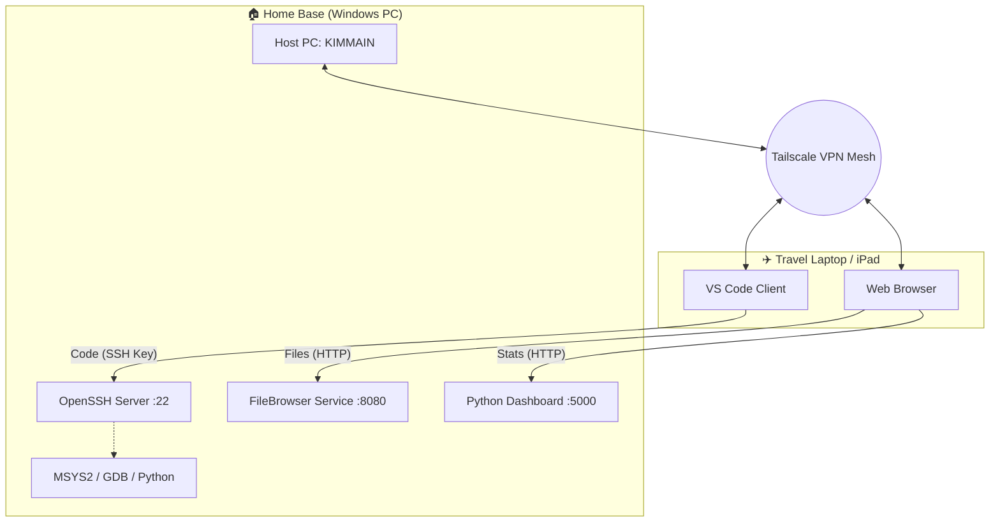

# Remote-Dev-Setup with Private NAS by kimzam

**Remote Programming** With Visual Studio Code (VSC) on a **Private Windows NAS**

A resilient, secure remote development environment allowing full coding capabilities and NAS access from anywhere in the world, hosted on a Windows machine.

## Architecture

* **Host Machine:** Windows Desktop (Always ON)
* **Network:** Tailscale Mesh VPN (Direct P2P Connection)
* **Primary Code Access:** VS Code Remote SSH (Low Latency)
* **Backup Access:** VS Code Tunnels (Web-based Fallback)
* **Development Environment:** * **C++:** MSYS2 / MinGW-w64 (GCC & GDB)
    * **Terminal:** PowerShell Core + Starship Prompt
* **File Access:** FileBrowser (Self-hosted web GUI)

## 🛠 Configuration Steps

### 1. Network & Security
* **VPN:** Installed Tailscale for secure, zero-config networking.
* **Firewall:** Whitelisted Tailscale subnet (`100.x.x.x`) for seamless access.
* **Performance:** Disabled SMB Multichannel to prevent throttling:
    `Set-SmbServerConfiguration -Enable Multichannel $false -Force`

### 2. SSH Access (Primary)
* **Service:** Enabled Windows OpenSSH Server (`sshd`) with automatic startup.
* **Authentication:** Configured **Ed25519 SSH Keys** for password-less, secure login.
* **Permissions:** Fixed "Administrators" permission conflicts in `sshd_config` to allow key-based auth.

### 3. Development Tools
* **C++ Toolchain:** Installed **MSYS2 (UCRT64)** to provide `g++` and `gdb` on Windows.
* **Debugging:** Configured VS Code `launch.json` to map the custom `miDebuggerPath` for remote debugging.
* **Terminal Customization:** Installed **Starship** cross-shell prompt with **Nerd Fonts** for git status & error tracking.

### 4. Web NAS (FileBrowser)
* **Tool:** [FileBrowser](https://filebrowser.org)
* **Persistence:** Used NSSM (Non-Sucking Service Manager) to run the binary as a background Windows service.
* **Command:** `.\filebrowser.exe -r "D:\Files" -a 0.0.0.0 -p 8080`

### 5. Server Health Dashboard
* **Location:** `/dashboard` folder
* **Features:** Real-time CPU/RAM usage, Service Status checks (SSH & NAS).
* **Access:** `http://<tailscale-ip>:5000`

## How to Connect

* **Coding (VS Code):** Connect via Remote SSH to `nomad@<tailscale-ip>`
* **Terminal:** `ssh nomad@<tailscale-ip>`
* **Files:** `http://<tailscale-ip>:8080`
* **Dashboard:** `http://<tailscale-ip>:5000`

## 🗺️ Network Architecture

## 📝 Notes
* Tailscale MagicDNS makes remembering IPs unnecessary.

* Workspace Trust: Configured VS Code to trust the remote project root to suppress security popups.

* Formatting: Enabled Format On Save using the Microsoft C/C++ extension.

## 💻 Hardware Specs
Host Machine: KIM_MAIN

CPU: Ryzen 5 5500G

RAM: 64GB DDR4 (Crucial for Running VS Code Server + NAS)

Storage: 512GB (OS), 4TB (NAS Storage)

Client Machine: Dell XPS 15 / Samsung Tab S9 FE

OS: Windows 11 / Android

## Roadmap
[x] Server Health Dashboard: Built a custom Python/Flask app to monitor CPU/RAM and Service Uptime.

[x] Secure SSH: Implemented Key-based authentication (No Passwords).

[ ] Set up Wake-On-Lan (WOL) to turn on the PC remotely.

[ ] Add Docker to the Host PC for running containers (PostgreSQL, etc.).

[ ] Create a backup script to mirror the NAS to Google Drive.